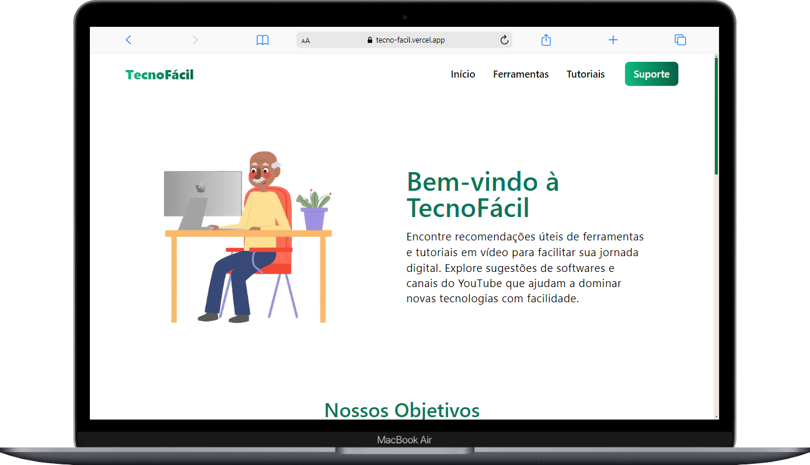
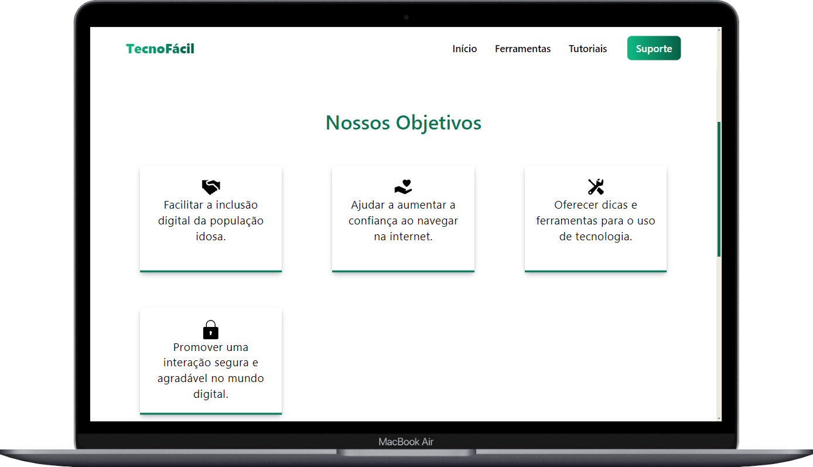
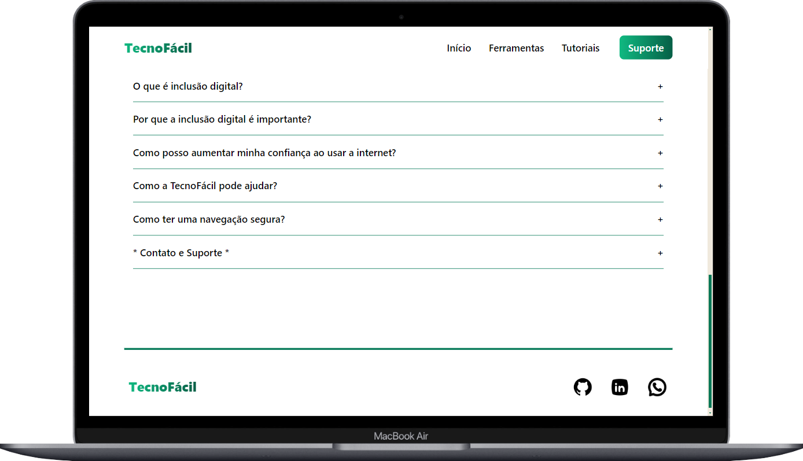
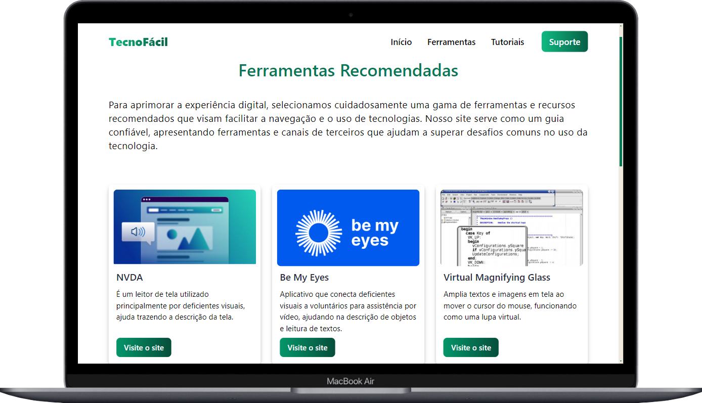
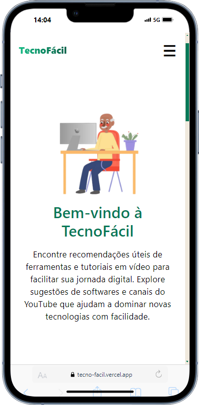
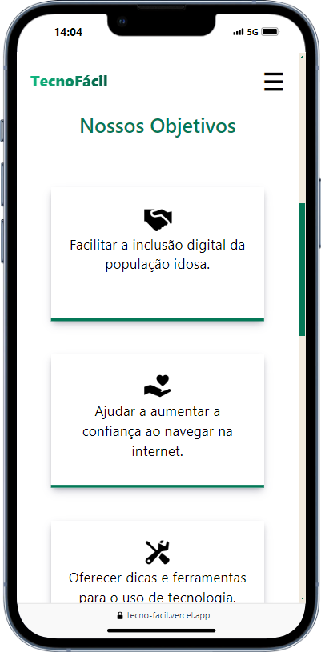
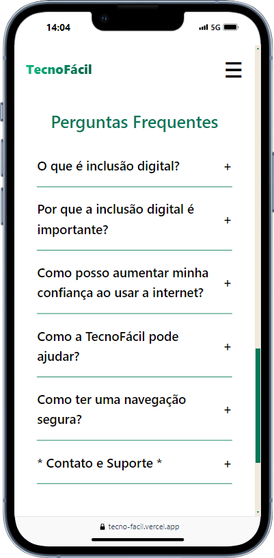

<h1 align="center">
  👴🏽
   
  Inclusão Digital na Terceira Idade
  

    
    
    
  

</h1>

Este projeto foi desenvolvido com o objetivo de auxiliar a população idosa a navegar na internet de forma mais segura e eficiente, promovendo a inclusão digital para esse público. O site oferece dicas de tutoriais e ferramentas para facilitar o uso da tecnologia por pessoas idosas.

### Versão Desktop

  
  

### Versão Mobile

  

## 📍 Objetivo
O principal objetivo deste projeto é fornecer uma plataforma acessível e fácil de usar para idosos receberem recomendações, para aprenderem a utilizar tecnologias modernas, como navegação na web, uso de aplicativos, gerenciadores de senha e leitores de tela.

## 🔄 Funcionalidades
+ Sugestões de canais com tutoriais em vídeo sobre navegação na internet, segurança online e uso de aplicativos populares.
+ Dicas de ferramentas úteis, como gerenciadores de senhas e leitores de tela, com links para seus respectivos sites.
+ Compatibilidade móvel: O site é totalmente responsivo, permitindo fácil acesso por smartphones e tablets.

## 🚀 Tecnologias Utilizadas
+ , , , ,  e 
+ Deploy: O site está hospedado publicamente no Vecel para ser acessado pela comunidade => [Confira aqui](https://tecno-facil.vercel.app/)

## 🤝 Contribuição
Contribuições são bem-vindas! 
1. Faça um fork deste repositório.
2. Crie uma branch para a sua feature (git checkout -b feature-nome-da-feature).
3. Faça o commit das suas alterações (git commit -m 'Adiciona nova feature').
4. Envie para o repositório remoto (git push origin feature-nome-da-feature).
5. Crie um novo Pull Request.

## 🌐 Contato
Caso tenha dúvidas ou sugestões, entre em contato:

LinkedIn: [Francine Cruz](https://www.linkedin.com/in/francine-ccruz/)
