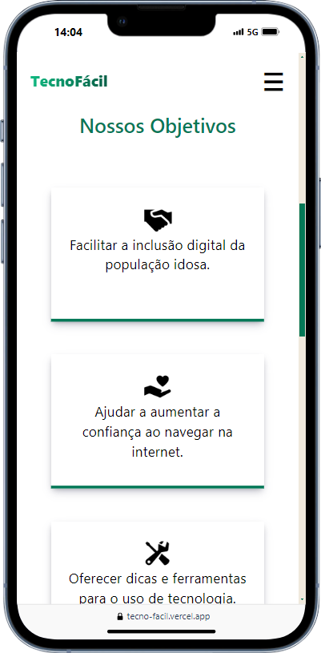

# Inclusão Digital na Terceira Idade
Este projeto foi desenvolvido com o objetivo de auxiliar a população idosa a navegar na internet de forma mais segura e eficiente, promovendo a inclusão digital para esse público. O site oferece dicas de tutoriais e ferramentas para facilitar o uso da tecnologia por pessoas idosas.

## Objetivo
O principal objetivo deste projeto é fornecer uma plataforma acessível e fácil de usar para idosos receberem recomendações, para aprenderem a utilizar tecnologias modernas, como navegação na web, uso de aplicativos, gerenciadores de senha e leitores de tela.

## Funcionalidades
+ Sugestões de canais com tutoriais em vídeo sobre navegação na internet, segurança online e uso de aplicativos populares.
+ Dicas de ferramentas úteis, como gerenciadores de senhas e leitores de tela, com links para seus respectivos sites.
+ Compatibilidade móvel: O site é totalmente responsivo, permitindo fácil acesso por smartphones e tablets.

## Tecnologias Utilizadas
+ React.js, Tailwind CSS, Typescript, HTML, CSS e EmailJs
+ Deploy: O site está hospedado publicamente no Vecel para ser acessado pela comunidade => [Confira aqui](https://tecno-facil.vercel.app/)

## Contribuição
Contribuições são bem-vindas! Se você tem ideias de melhorias ou deseja relatar um problema, sinta-se à vontade para abrir uma issue ou enviar um pull request.

## Contato
Caso tenha dúvidas ou sugestões, entre em contato:

LinkedIn: [Francine Cruz](https://www.linkedin.com/in/francine-ccruz/)
